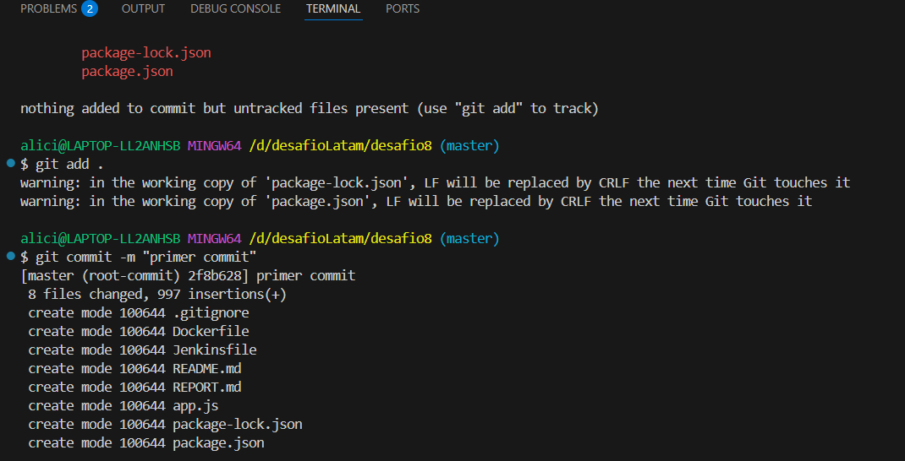
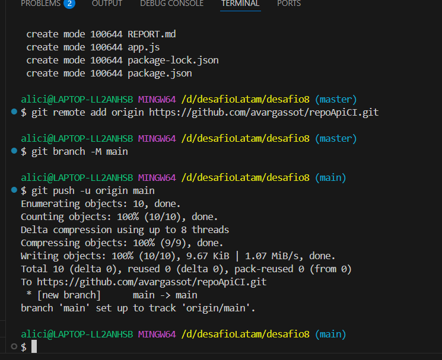
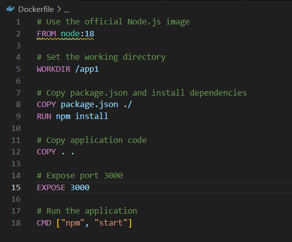
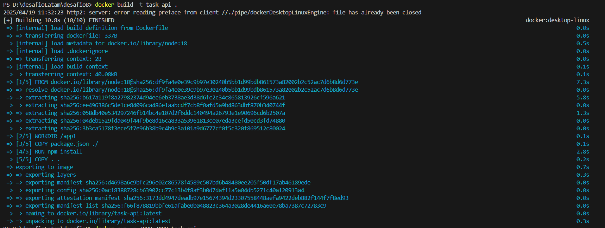
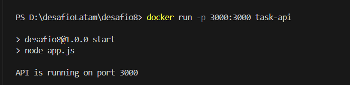
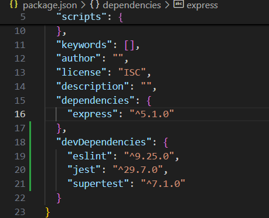
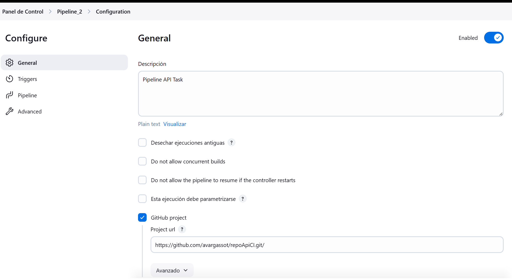

# Pipeline Execution Report

## Summary

This report outlines the steps taken to configure and execute the CI/CD pipeline for the Task API project.

## Steps

1. **Git Repository Management**  
     
- Initialized a local repository and connected it to GitHub.
``` git init ```
- add changes ``` git add .```
- commit changes ``` git commit -m "primer commit" ```
- connect  to remote github repository
    - ``` git remote add origin https://github.com/avargassot/repoApiCI.git ```

    - ``` git branch -M main ```


   

2. **Docker Integration**  
     
   - Created a Dockerfile to containerize the application.
   - Build de image  ``` docker build -t task-api ```
   - Execute containerize  ``` docker run -p 3000:3000 task-api ```

3. **Install dependencies Test**
    - Install Jest, supertest, esñinmt ```  npm install jest supertest eslint -D ```


   

3. **Jenkins Configuration**  
     
   - Configured Jenkins to automate the build, test, and deploy process.

## Issues Encountered

- \[Optional section for issues\]

## Results

- \[Add screenshots or logs of successful pipeline runs\]
1.  Git init

2.  Git Remote

3.  Create Docker

4.  Docker Build

5.  Docker Run

6. Install dependencies Test

7. Config Pipeline Jenkins



